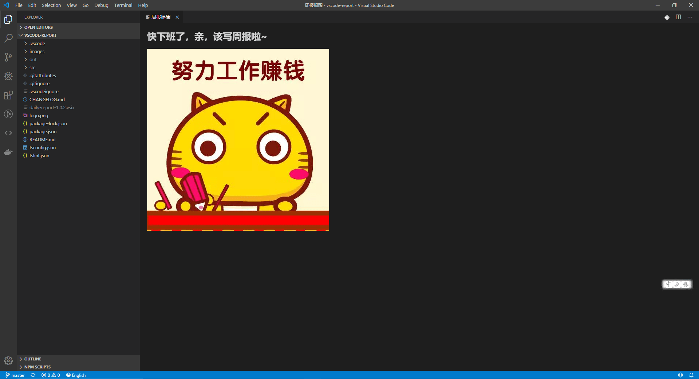

# 周报(日报)提醒插件

每周五下班前或自定义时间会有插件提醒你写周报(日报)。

Every Friday before leaving work or at a custom time, it will remind you to write a weekly newspaper (daily newspaper).

## 使用

除了每周五或自定义时间会自动弹出提醒页面，也可以按 `F1`, 然后输入 `report:打开周报提醒`来打开提醒页面

In addition to automatically popping up the reminder page every Friday or at a custom time, you can also press `F1` and enter `report:打开周报提醒` to open the reminder page.



## 在vscode setting.json中进行配置

- `report.title`: 提示文字。 (默认值为**快下班了，亲，该写周报啦~**)
- `report.type`: default (默认图)；url (图片地址)。(默认值为**default**)
- `report.customImages`: 配置图片数组（需要搭配 report.type 为 url） (默认值为**默认图片**)
- `report.reminderViewDay`: 是否是日报，默认false
- `report.reminderViewWeek`: 周几出现周报提醒，默认周五
- `report.reminderViewHour`: 几点出现日报、周报提醒，默认17点

- `report.title`: prompt text(default value: **快下班了，亲，该写周报啦~**)
- `report.type`: default (default image), url (image urls)。(default value: **default**)
- `report.customImages`: configure an array of images(need **report.type** 为 **url**)(default value: **默认图片**)
- `report.reminderViewDay`: Is it a daily report(default value: **false**)
- `report.reminderViewWeek`: What day remind you to write weekly report(default value: **Friday**)
- `report.reminderViewHour`: What time remind you to write daily and weekly report(default value: **17 hours**)

```
如下例子，使用自定义图片：
"report.type": "url",
"report.customImages": [
    "http://images.xuejuzi.cn/1905/1_190501101421_1.jpg"
]
```
```
如下例子，配置周几提醒，可取值[0, 1, 2, 3, 4, 5, 6]:[周日, 周一, 周二, 周三, 周四, 周五, 周六]：
"report.reminderViewWeek": 6,
```
